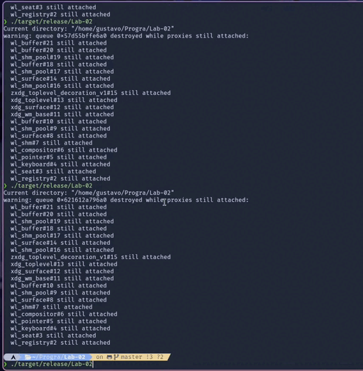

# Lab-02: Game of Life

Este es un proyecto en Rust que implementa el Conway's Game of Life. La aplicación carga un archivo de imagen, preferiblemente un png, y utiliza su información para inicializar el tablero del juego.

## GIF de Demostración



## Requisitos

- [Rust](https://www.rust-lang.org/) (incluye `cargo` para manejar las dependencias y la compilación).
- Dependencias necesarias en el archivo `Cargo.toml`:
  - `minifb` para la creación y manejo de ventanas.
  - `image` para manipulación de imágenes.

## Instalación

1. Clona el repositorio en tu máquina local:
   ```bash
   git clone https://github.com/G2309/GC_Lab-02.git
   cd Lab-02
   cargo build --release
   ./target/release/Lab-02
